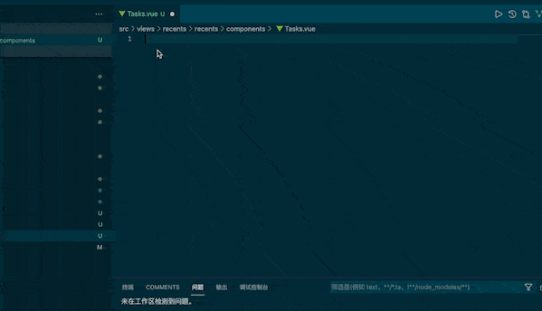

# vue3-vben-snippets

vue3-vben-snippets 是一款快速生成 vue3+vben 页面结构的用户代码片段插件

效果图:



> vue-vben-page

```javascript
<template></template>
  <PageWrapper>
    <div :class="`${prefixCls}`">
      Template
    </div>
  </PageWrapper>
</template>
<script lang="ts" setup>
  import { PageWrapper } from '/@/components/Page';
  import { useI18n } from '/@/hooks/web/useI18n';
  import { useDesign } from '/@/hooks/web/useDesign';
  const { prefixCls } = useDesign('Template');
  const { t } = useI18n();
</script>
<style lang="less" scoped>
  @prefix-cls: ~'@{namespace}-Template';
  .@{prefix-cls} { color:#333 }
</style>
```

> vue-vben-component

```javascript
<template></template>
  <div :class="`${prefixCls}`">
    Template
  </div>
</template>
<script lang="ts" setup>
  import { useI18n } from '/@/hooks/web/useI18n';
  import { useDesign } from '/@/hooks/web/useDesign';
  const { prefixCls } = useDesign('Template');
  const { t } = useI18n();
</script>
<style lang="less" scoped>
  @prefix-cls: ~'@{namespace}-Template';
  .@{prefix-cls} { color:#333 }
</style>
```
